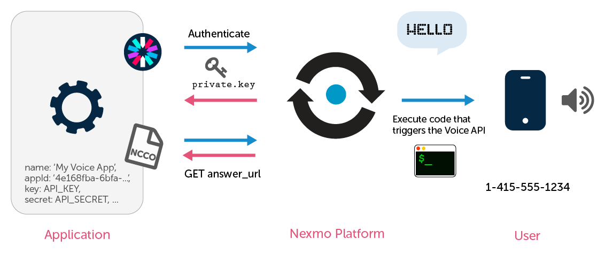
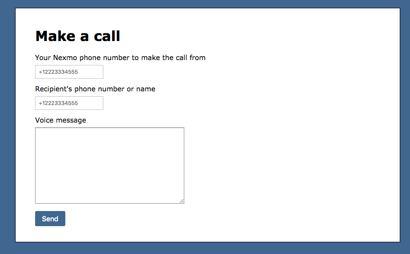
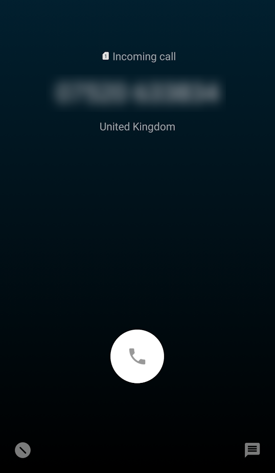

# How to Make an Outbound Text-to-Speech Phone Call with Ruby on Rails

_This is the first article in a series of "Getting Started with Nexmo Voice APIs and Ruby on Rails" tutorials. It continues the "Getting Started with Nexmo SMS and Ruby on Rails" series._

With the help of the [Nexmo Voice API](https://docs.nexmo.com/messaging/voice-api) you can make worldwide outbound and inbound calls in 23 languages with varieties of voices and accents. All you need is your virtual phone number, the [Ruby Gem](https://github.com/Nexmo/nexmo-ruby), and a few lines of code.

In this tutorial, and the ones to follow, I will take you through some real-life examples of how to integrate Nexmo into your Rails application. We will see how to set up the basics, and then we will write some code together to properly integrate Nexmo to start making and receiving phone calls. Let's get started!

[View the source code on GitHub](https://github.com/workbetta/nexmo-rails-quickstart/blob/master/app/controllers/outbound_calls_controller.rb)

## Prerequisites

For this tutorial I assume you will:

- Have a basic understanding of Ruby, and Rails
- Have [Rails](http://rubyonrails.org/) installed on your machine
- Have [NPM](https://www.npmjs.com/) installed for the purpose of our CLI

## Get Your API Keys

Before we can make our first API call you will need to [sign up for a Nexmo account](https://dashboard.nexmo.com/sign-up). Once you've signed up you can head over to the [Settings page](https://dashboard.nexmo.com/settings) to fetch your API credentials.

[`dashboard.nexmo.com/settings`](https://dashboard.nexmo.com/settings)


## Buy a Nexmo Number using the CLI

One of the easiest ways to purchase virtual phone numbers, setup applications, and configuring them all is using the Nexmo CLI tool](<https://github.com/nexmo/nexmo-cli>). In this tutorial we will use this as our main way of preparing our application.

The Nexmo CLI is a Node module, and therefore does require NPM to have been installed.

```sh
$ npm install nexmo-cli -g
$ nexmo setup YOUR-API-KEY YOUR-API-SECRET
Credentials written to /Users/your_username/.nexmorc
```

With this in place, we can run the following commands to find and purchase an Voice enabled number:

```sh
$ nexmo number:search US --voice
12015555522
12015555815
12025555296
$ nexmo number:buy 12015555522 --confirm
Number purchased: 12015555522
```

Alternatively, head over to the [Numbers page](https://dashboard.nexmo.com/buy-numbers) on the Nexmo Dashboard and purchase a number via the web interface.

## Create a Nexmo Application

In our previous serious of SMS tutorials we were able to configure a phone number directly with an endpoint. In this tutorial, we will be using the new, more powerful and more secure [Nexmo Applications](https://developer.nexmo.com/api/application) API for configuring our callbacks.



_Diagram: Using The Voice API to call your mobile phone_

Our first step is to create an application, specifying the callback URLs for inbound calls (the `answer_url`) and call events (the `event_url`). Assuming your Rails application is publicly accessible either directly or via a tool like [ngrok](http://ngrok.io), your command will look something like this.

```sh
$ nexmo app:create "My Voice App" http://abc123.ngrok.io/inbound_calls http://abc123.ngrok.io/call_events --keyfile private.key --answer_method POST --event_method POST
Application created: abcd1234-ancd-abcd-abcd-abcd1234abcd
Private Key saved to: private.key
```

This will create a Nexmo Application with UUID `abcd1234-ancd-abcd-abcd-abcd1234abcd` and a private key stored in a file called `private.key`. Make sure you don't lose this key, Nexmo does not keep a copy and it's used to sign your API calls.

## Install the Nexmo Ruby Gem

The easiest way to interact with the Nexmo Voice API is with Ruby is using the [`nexmo` gem](https://github.com/Nexmo/nexmo-ruby).

```sh
gem install nexmo
```

This gem conveniently provides an easy wrapper around the [Nexmo REST API](https://developer.nexmo.com/api/voice). To initialize it, we will need to pass it the Application UUID and private key that we created earlier.

```ruby
nexmo = Nexmo::Client.new(
  application_id: 'abcd1234-ancd-abcd-abcd-abcd1234abcd',
  private_key: File.read('private.key')
)
```

## Make a Voice Call with Ruby

With our API client in place, making a first voice call is easy, we simply call the `create_call` method on the initialized client and pass in a configuration specifying who to call `to`, what number to call `from`, and an `answer_url` with a [Nexmo Call Control Object (NCCO)](https://docs.nexmo.com/voice/voice-api#ncco) containing the actions to play back to the receiver.

```ruby
nexmo.create_call({
  to: [
    {
      type: 'phone',
      number: '12025555511'
    }
  ],
  from: {
    type: 'phone',
    number: '12015555522'
  },
  answer_url: [
    'https://nexmo-community.github.io/ncco-examples/first_call_talk.json'
  ]
})
```

This will play back a simple voice message to the recipient as specified by [`first_call_talk.json`](https://nexmo-community.github.io/ncco-examples/first_call_talk.json). There are a lot more parameters that we could pass into this method, have a look at the [reference documentation](https://developer.nexmo.com/api/voice#payload) for full details.

## Make an Outbound Call from Ruby on Rails

In a Rails application we'd probably have a Model for Calls where we can store the `to`, `from`, and maybe the `text` to play to the recipient before making the Nexmo API call. In my demo application I've whipped up [a simple form](https://github.com/workbetta/nexmo-rails-quickstart/blob/master/app/views/outbound_calls/index.html.erb) for this model.

`localhost:3000/outbound_calls`



When the form is submitted, we store the Call record and then make the call. In a real application you might use a background queue for this, though in this case we will just pass the Call record to a new method.

```ruby
# config/routes.rb
Rails.application.routes.draw do
  resources :outbound_calls, only: [:index, :create, :show]
end

# app/controllers/outbound_calls_controller.rb
class OutboundCallsController < ApplicationController
  def create
    @call = Call.new(safe_params)

    if @call.save
      make @call
      redirect_to :outbound_calls, notice: 'Call initiated'
    else
      flash[:alert] = 'Something went wrong'
      render :index
    end
  end

  private

  def safe_params
    params.require(:call).permit(:to, :from, :text)
  end
end
```

Next, we can pass the call information to the Nexmo API.

```ruby
# app/controllers/outbound_calls_controller.rb
def make call
  response = nexmo.create_call({
    to: [
      {
        type: 'phone',
        number: call.to
      }
    ],
    from: {
      type: 'phone',
      number: call.from
    },
    answer_url: [
      outbound_call_url(call)
    ]
  })

  call.update_attributes(
    uuid: response['uuid'],
    status: response['status']
  ) if response['status'] && response['uuid']
end
```

The response object will contain a `uuid` if the call was initiated successfully. We can store the `uuid` and the current call `status` on the Call record. The `uuid` can be used to track the status of the SMS message, specifically when an [Call Update](https://developer.nexmo.com/api/voice#webhook) comes in via a webhook.

## Provide an NCCO to play back text

When we called the `create_call` method we passed in the the URL for the Call object as a parameter to the `answer_url`. Depending on your setup, that URL will look something like this:

`http://abc123.ngrok.io/outbound_call/123`

When the call is initiated, Nexmo will make a HTTP request to that endpoint expecting a NCCO object with the actions to perform. In our case, we want to simply play back the `text` we specified on the Call object.

```ruby
# app/controllers/outbound_calls_controller.rb
def show
  call = Call.find(params[:id])

  render json: [
      {
          "action": "talk",
          "voiceName": "Russell",
          "text": call.text
      }
  ]
end
```

Now go ahead, submit the form and within a few seconds you should receive a call playing back the message you just specified! There are many more actions you can specify in the [NCCO](https://docs.nexmo.com/voice/voice-api#ncco), have a play with them if you want.



## To sum things up

That's it for this tutorial. We've created a Nexmo account, installed the CLI, bought a number and created a Nexmo Application, installed and initialized the Ruby gem, and created a deep integration into our Rails application.

You can view the [code used in this tutorial](https://github.com/workbetta/nexmo-rails-quickstart/blob/master/app/controllers/outbound_calls_controller.rb) on GitHub.

## Next steps

In the next tutorials we will look at receiving Call Events for calls we've created, and how to receive inbound calls as well.
