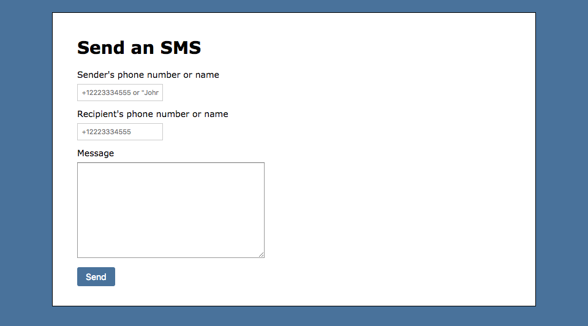
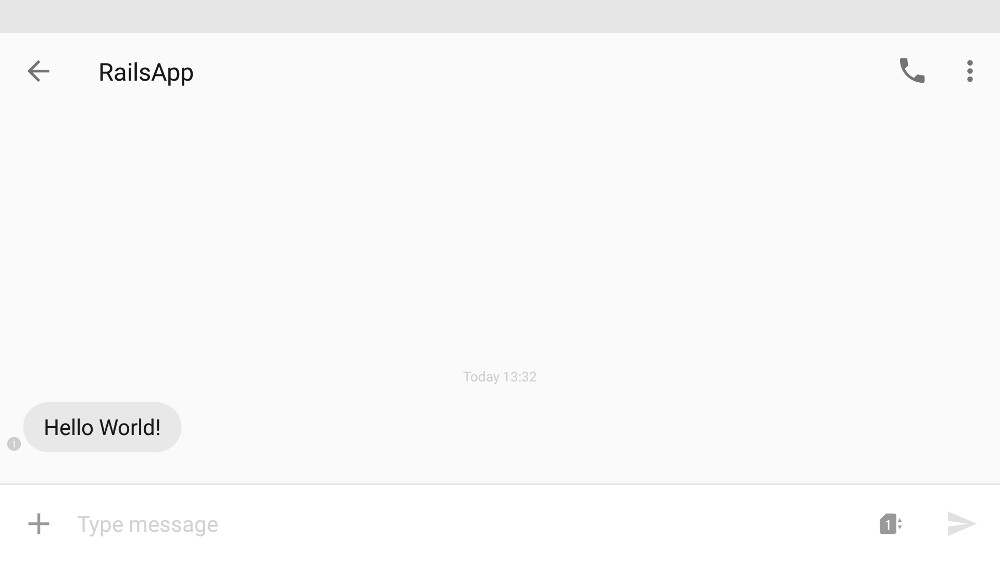

# How to Send SMS Messages with Ruby on Rails

_This is the first article in a series of "Getting Started with Nexmo SMS and Ruby on Rails" tutorials._

With the help of the [Nexmo SMS API](https://docs.nexmo.com/messaging/sms-api) you can send SMS anywhere in the world. All you need is your virtual phone number, the [Ruby Gem](https://github.com/Nexmo/nexmo-ruby), and a few lines of code.

In this tutorial, and the ones to follow, I will take you through some real-life examples of how to integrate Nexmo into your Rails application. We will see how to set up the basics, and then we will write some code together to properly integrate Nexmo. Let's get started!

[View the source code on GitHub](https://github.com/workbetta/nexmo-rails-quickstart/blob/master/app/controllers/outbound_sms_controller.rb)

## Prerequisites

For this tutorial I assume you will:

- Have a basic understanding of Ruby, and Rails
- Have [Rails](http://rubyonrails.org/) installed on your machine

## Get Your API Keys

Before we can make our first API call you will need to [sign up for a Nexmo account](https://dashboard.nexmo.com/sign-up). Once you've signed up you can head over to the [Settings page](https://dashboard.nexmo.com/settings) to fetch your API credentials.

[`dashboard.nexmo.com/settings`](https://dashboard.nexmo.com/settings)


## Buy a Nexmo Number

While in some countries you can send an SMS without buying a Virtual Nexmo Number, other countries like the USA will require you to have a Nexmo number for your SMS messages to originate from.

There are 2 ways to purchase a Nexmo number. The first way is to install the [Nexmo CLI tool](https://github.com/nexmo/nexmo-cli) (a NodeJS command line interface) and then run the following commands to find and purchase an SMS enabled number:

```sh
$ nexmo number:search US --sms
12015555522
12015555815
12025555296
$ nexmo number:buy 12015555522 --confirm
Number purchased: 12015555522
```

Alternatively, head over to the [Numbers page](https://dashboard.nexmo.com/buy-numbers) on the Nexmo Dashboard and purchase a number via the web interface.

## Install the Nexmo Ruby Gem

The easiest way to send an SMS with Ruby is using the [`nexmo` gem](https://github.com/Nexmo/nexmo-ruby).

```sh
gem install nexmo
```

This gem conveniently provides an easy wrapper around the [Nexmo REST API](https://developer.nexmo.com/api/sms). To initialize it, just provide the credentials we found earlier.

```ruby
nexmo = Nexmo::Client.new(
  key: 'YOUR-API-KEY',
  secret: 'YOUR-API-SECRET'
)
```

If you are using environment variables in your application you can even shorten this code further, as the gem automatically picks up the `NEXMO_API_KEY` and `NEXMO_API_SECRET` variables if they are specified.

```ruby
nexmo = Nexmo::Client.new
```

## Send an SMS Message with Ruby

With our API client in place, sending an SMS is easy, we simply call the `send_message` method on the initialized client and pass in the phone number we want to send `to`, the Nexmo number we want the number to appear `from`, and the `text` to send.

```ruby
response = nexmo.send_message(
  from: '12015555522',
  to: '12025555511',
  text: 'Hello World!'
)
```

There are a lot more parameters that we could pass into this method, have a look at the [reference documentation](https://docs.nexmo.com/messaging/sms-api/api-reference#request) for full details.

## Send an SMS Message from Rails

In a Rails application we'd probably have a Model for SMS where we can store the `to`, `from`, and `text` data before sending it off to Nexmo. In my demo application I've whipped up [a simple form](https://github.com/workbetta/nexmo-rails-quickstart/blob/master/app/views/outbound_sms/index.html.erb) for this model.

`localhost:3000/outbound_sms`



When the form is submitted, we store the SMS record and then send the SMS. In a real application you might use a background queue for this, though in this case we will just pass the SMS record to a new method.

`app/controllers/outbound_sms_controller.rb`

```ruby
def create
  @sms = Sms.new(safe_params)

  if @sms.save
    deliver @sms
    redirect_to :outbound_sms, notice: 'SMS Sent'
  else
    flash[:alert] = 'Something went wrong'
    render :index
  end
end

private

def safe_params
  params.require(:sms).permit(:to, :from, :text)
end
```

All we are left with then is to send the SMS using the Nexmo API.

```ruby
def deliver sms
  response = nexmo.send_message(
    from: sms.from,
    to: sms.to,
    text: sms.text
  )

  if response['messages'].first['status'] == '0'
    sms.update_attributes(
      message_id: response['messages'].first['message-id']
    )
  end
end
```

The response object might contain multiple `message` objects, as your request might have been broken up into multiple SMS messages due to the 160 character limit. If the status equals `0` the message has been queued with Nexmo, and we can store the `message-id` on the SMS record. The `message-id` can be used to track the status of the SMS message, specifically when a [Delivery Receipt](https://developer.nexmo.com/api/sms#delivery-receipt) comes in via a webhook.

Now go ahead, submit the form and within a few seconds you should see an SMS arrive!



## To sum things up

That's it for this tutorial. We've created a Nexmo account, fetched our API credentials, installed and initialized the Ruby gem, and created a deep integration into our Rails application.

You can view the [code used in this tutorial](https://github.com/workbetta/nexmo-rails-quickstart/blob/master/app/controllers/outbound_sms_controller.rb) on GitHub.

## Next steps

In the next tutorials we will look at receiving Delivery Receipts for messages we've sent, and how to receive inbound SMS messages as well.
